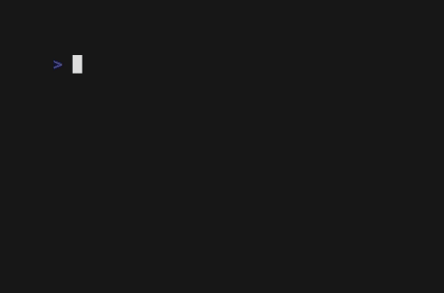

A set of pure JS extensions for [QuickJS](https://github.com/ctn-malone/quickjs-cross-compiler)

* parse command line arguments and build static command line utilities using JS (see [doc](doc/arg.md))
* execute external processes asynchronously (see [doc](doc/process.md))
* setInterval / clearInterval / wait functions (see [doc](doc/timers.md))
* *curl* wrapper supporting all HTTP methods and most of *curl* options (see [doc](doc/curl.md))
* *ssh* wrapper (for quick-and-dirty remote scripting without [ansible](https://github.com/ansible/ansible)) (see [doc](doc/ssh.md))
* minimal unit testing library (see [doc](doc/tester.md))
* semver versions comparison (see [doc](doc/version.md))
* interact with [pass](https://www.passwordstore.org/) (see [doc](doc/password-store.md))
* build glamorous shell scripts using [gum](https://github.com/charmbracelet/gum) (see [doc](doc/gum.md))

# Rational

I'm focused on building static binaries targeting linux command line. This library is an intent at providing just enough to make creating static adhoc scripts easier on linux. This library is for you if you're interested in doing one of the following

- build decent CLIs easily
- consume the output of external programs
- build CI pipelines which don't need dependencies beyond standard unix utilities
- consume a HTTP API without depending on 100's of packages (only `curl` binary is needed)

# Nix

## Nix shell

In order to get a shell with the static interpreter (`qjs.sh`) and compiler (`qjsc.sh`), as well as this library, run following command

```
nix develop github:ctn-malone/qjs-ext-lib
```

Following commands can also be used to run `qjs.sh` or `qjsc.sh` using `nix run`

- run `qjs.sh`

```
nix run github:ctn-malone/qjs-ext-lib#qjs
```

- run `qjsc.sh`

```
nix run github:ctn-malone/qjs-ext-lib#qjsc
```

Inside the Nix shell, any `.js` file from the library can be imported from an `ext` directory

```js
import { curlRequest } from 'ext/curl.js';

/*
    Perform a POST request to https://jsonplaceholder.typicode.com/posts and print response payload
 */

const main = async () => {
    const body = await curlRequest('https://jsonplaceholder.typicode.com/posts', {
        method:'post',
        json: {
            title: 'foo',
            body: 'bar',
            userId: 1
        }
    });
    console.log(JSON.stringify(body, null, 4));
}

main();
```

## Bootstrap a new project

In order to bootstrap a new project in your current directory, following command can be run

```
nix run 'github:ctn-malone/qjs-ext-lib#bootstrap'
```

Above command will do the following

- initialize a git repository
- create a flake
- add an example script


# Examples

## Execute external processes

```js
import { exec } from './src/process.js';

/*
  Run 3 external commands in parallel 
 */

const main = async () => {
  const commands = ['date', 'uptime', 'which sh'];
  const promises = [];
  commands.forEach((c) => promises.push(exec(c)));
  (await Promise.all(promises)).forEach((output, i) => {
    console.log(`${commands[i]} => ${output}`);
  });
};

main();
```

See more [examples](examples/process)

## Perform REST calls

```js
import { curlRequest } from './src/curl.js';

/*
  Perform a POST request to https://jsonplaceholder.typicode.com/posts and print response payload
 */

const main = async () => {
  const body = await curlRequest('https://jsonplaceholder.typicode.com/posts', {
    method: 'post',
    json: {
      title: 'foo',
      body: 'bar',
      userId: 1,
    },
  });
  console.log(JSON.stringify(body, null, 4));
};

main();
```

See more [examples](examples/curl)

## Execute remote command through SSH

```js
import * as std from 'std';
import { Ssh } from './src/ssh.js';

/* 
  Run 'uptime' through SSH
 */

const main = async () => {  
  const ssh = new Ssh(`localhost:22`, 'uptime');
  const result = await ssh.run();
  if (!result) {
    console.log(`An error occurred: ${ssh.sshError || ssh.stderr}`);
    std.exit(1);
  }
  console.log(ssh.stdout);
};

main();
```

See more [examples](examples/ssh)

## Parse command-line arguments

```js
import arg from './src/arg.js';

/*
  Say hello
  Argument '--name' can also be passed through 'NAME' environment variable
 */

const main = async () => {
  const args = arg
    .parser({
      '--name': arg.str().req().desc('your name').env('NAME'),
      '-n': '--name',
    })
    .parse();

  console.log(`Hello ${args['--name']} !`);
};

main();
```

See more [examples](examples/cmdline)

## Build CLI tools

```js
import * as gum from 'ext/gum.js';

while (true) {
  const expectedNumber = (Math.floor(Math.random() * 5) + 1).toString();
  const item = gum.chooseItemFromList(
    [1, 2, 3, 4, 5].map((e) => e.toString()),
    {
      header: 'Please try to guess my number',
      cursor: '-> ',
    }
  );
  if (!item) {
    break;
  }
  let message =
    item.value === expectedNumber.toString()
      ? gum.style('Correct !', { foreground: '#00ff00' })
      : gum.style('Wrong !', { foreground: '#ff0000' });
  console.log(
    `${message} The number was ${gum.style(expectedNumber, { bold: true })}`
  );
  if (!gum.confirm({ prompt: 'Do you want to play again ?' })) {
    break;
  }
}
console.log('Goodbye !');
```



See more [examples](examples/gum)

# Run unit tests

Run `run.js` under `test` directory

```
qjs run.js
```

<u>NB</u>: some tests will be skipped unless specific environment variables are defined

* ssh : by default, no real SSH connection will be made from unit tests. Following environment variables can be defined to change behaviour
  * QJS_EXT_LIB_TEST_SSH_REAL_CONNECT : if set to `1`, SSH connections will be made to localhost to execute scripts located under `test/data` (ensure that current user is allowed to SSH to localhost using default SSH key)
  * QJS_EXT_LIB_TEST_SSH_REAL_LOCAL_FORWARD : if set to `1`, real local SSH forward will be tested (will be ignored if `QJS_EXT_TEST_SSH_REAL_CONNECT` != `1`)
  * QJS_EXT_LIB_TEST_SSH_REAL_REMOTE_FORWARD : if set to `1`, real remote SSH forward will be tested (will be ignored if `QJS_EXT_TEST_SSH_REAL_CONNECT` != `1`)